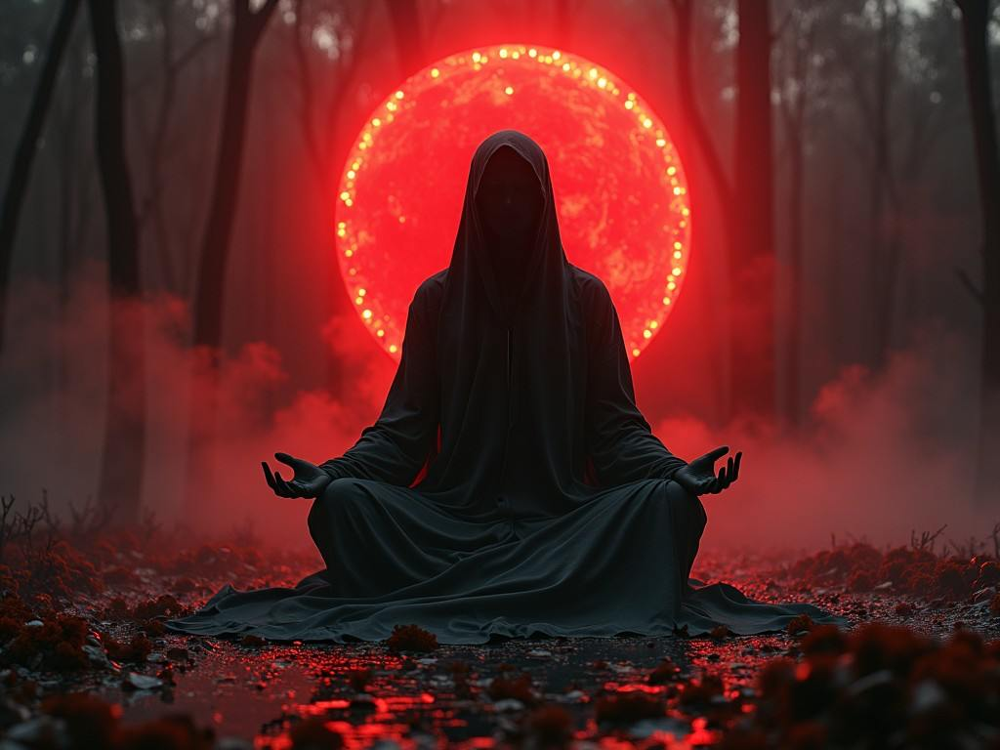

  
  <!-- Анимированный фоновый хедер в красном неоне -->
  
  
  <!-- Wake up Neo Message в красном неоне -->
  
  
  <!-- Глитч-эффект с основным изображением -->
  

    
    

  

  
  <!-- System Messages в красном неоне с анимацией -->
  
  
  <!-- Cyber Badge Metrics -->
  

    
    
    
    
  

  
  <!-- Неоновая разделительная линия -->
  

  <!-- Code Analysis с красным неоном -->
  

    <h2 style="color: #FF3131; text-shadow: 0 0 5px #FF3131; margin-bottom: 20px;">⌨️ CODE ANALYSIS</h2>
    
  

  
  <!-- Расширенная секция навыков с анимацией -->    

<h2 style="color: #FF0000; text-shadow: 0 0 5px #FF0000; margin-bottom: 20px;">ARSENAL</h2>

<!-- Основные языки и технологии в красном неоне -->

<h3 style="color: #FF3131; text-shadow: 0 0 3px #FF3131;">PRIMARY WEAPONS</h3>

<!-- Фреймворки и библиотеки -->

<h3 style="color: #FF3131; text-shadow: 0 0 3px #FF3131;">TECH ARSENAL</h3>

<!-- Инструменты разработки -->

<h3 style="color: #FF3131; text-shadow: 0 0 3px #FF3131;">TOOLS</h3>

  <!-- GitHub Streak с красным неоном -->
  

    <h2 style="color: #FF3131; text-shadow: 0 0 5px #FF3131; margin-bottom: 20px;">NEURAL ACTIVITY</h2>
    
  

  <!-- Анимированная змейка в красном неоне -->
  

    <h2 style="color: #FF3131; text-shadow: 0 0 5px #FF3131; margin-bottom: 20px;">MATRIX CODE</h2>
    
  

  <!-- Расширенная контактная секция -->
  

    <h2 style="color: #FF3131; text-shadow: 0 0 5px #FF3131; margin-bottom: 20px;">ENCRYPTED CHANNELS</h2>
    

      
    

  

  
  <!-- Matrix кодовый дождь (визуализация подвала) в красном неоне -->
  

    
  

